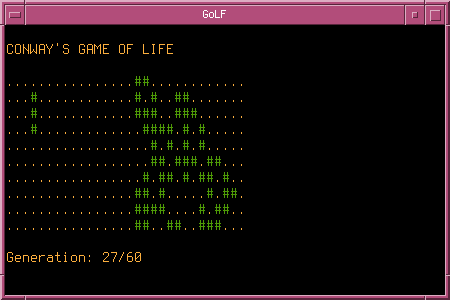

# Game of Life (Fortran)
Simple text-based clone of the popular cellular automaton written in Fortran
2003. Should run on most Unix-like operating systems.



## Build
You can use CMake and GNU Fortran to build the game:

```
$ mkdir build && cd build/
$ cmake ..
$ make
```

If you do not want to use CMake, run:

```
$ gfortran9 -c src/getopt.f90
$ gfortran9 -o golf src/golf.f90 getopt.o
```

## Run
```
$ ./golf --file world.txt --columns 30 --rows 10 --generations 100
```

## Licence
ISC
